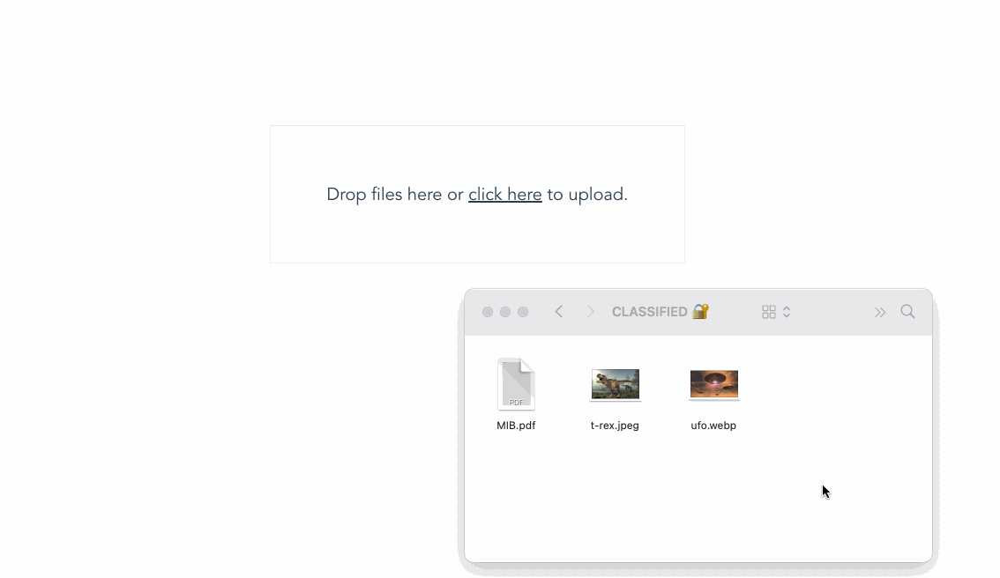

### 개요
nsfw  Image classify
(AI Model활용 부적절 이미지 판정)
- 백엔드 서비스: FastApi (Python)
- 프론트 : Vue

### 사용법
Image를 업로드시 부적합 여부를 AI 모델에 의해 판단 결과 조회됨





### 프로그램 구성도


### FrontEnd 설정 
- .env 파일에 백엔드 서비스 url 입력
  ```
  예) VUE_APP_API_URL=http://xxxxxx:8001
  ```
 
- 모듈 설치

```bash
npm install
# OR
yarn install
```

- 컴파일 및 서버 실행 
```bash
npm run serve
# OR
yarn serve
```
- 웹서버에 배포시 빌드
```bash
npm run build
# ORD
yarn build
```
- ERR_OSSL_EVP_UNSUPPORTED' 에러 발생시
  ```set NODE_OPTIONS=--openssl-legacy-provider```
- 규칙에 맞도록 소스 보완 시 사용 
```
yarn lint
```

### BackEnd 설정 
- .env.dev 파일 생성 후 아래 url을 추가
  ```
  FAST_API_SERVER_PATH =/home/xxxxx/vue_fastapi/BackEnd/  ( 실행 소스 루트 경로 )
  AI_MODEL_PATH=/home/xxxxxx/vue_fastapi/BackEnd/app/nsfw_mobilenet2.224x224.h5  (모델 파일 경로)
  WEB_URL=http://xxxxxxx:8080   (프론트 실행 포트: 로컬에서 실행시 cors 막힘 방지) 
  ```

- 설정 customize (필요시)
#GPU 사용하지 않는 환경이라면 
환경설정에  gpu 사용안함값 설정해야 :TF_ENABLE_ONEDNN_OPTS  -> 0
```
export  TF_ENABLE_ONEDNN_OPTS =0 
```

```
 pip install tensorflow
 pip install tensorflow_hub
 #protobuf 버전 에러 발생시
 pip install --upgrade "protobuf<=3.20.1"
```
```
#fastApi 관련 설치
pip install fastapi uvicorn pyton-dotenv python-multipart aiofiles
  
fastapi==0.110.2 
uvicorn==0.30.1 
python additonal python-dotenv==0.21.1 
python-multipart==0.0.9 
aiofiles==24.1.0
```

### 참고한 소스 
AI Detect Model : https://github.com/GantMan/nsfw_model.git
